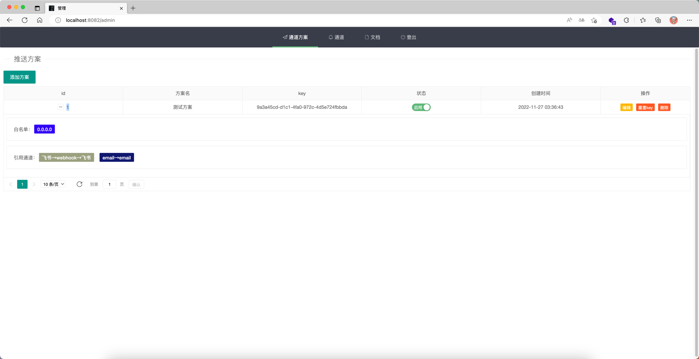
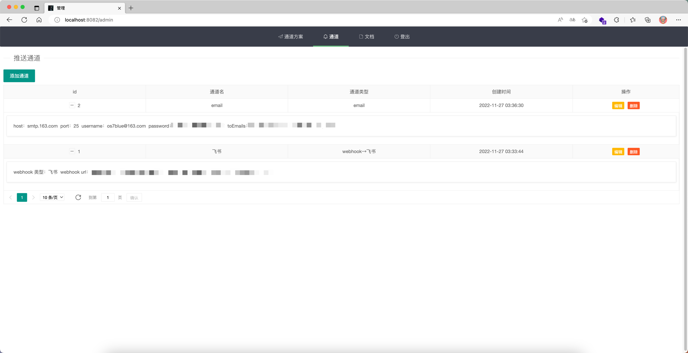
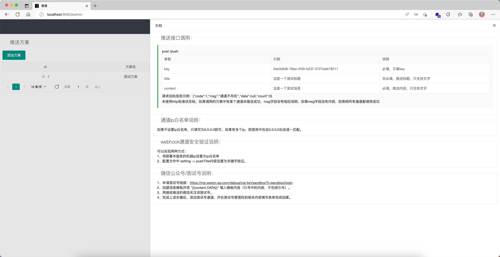

# dobby 多通道消息推送服务

2.x版本feature：
- 各个自建应用
- 日志内容支持
- pushbeer支持
- 短信支持
- 复杂内容支持md/html/text
- 高频调用优化

界面：




流程：


支持推送通道：

    - 微信公众号/测试号
    - 企业微信webhook机器人
    - 钉钉webhook机器人
    - 飞书webhook机器人
    - email
    - 智能音箱（待定）

项目结构：

```
├── api //service api
├── common  //global util
│   └── sender  //all message sender
├── bootstrap  //projrct config init
├── doc 
├── model   //struce(like oop model)
│   ├── constant    //
│   └── r   //unified return model
├── router
├── service
├── view
│   ├── static
│   │   ├── css
│   │   ├── fonts
│   │   ├── img
│   │   ├── js
│   │   └── module
│   └── templates
├── config.ini //config file
├── main.go //starter
```

安装说明：
    
```
    
    1、配置go环境，clone本项目。
    2、打包。
    3、创建一个sqlite的.db文件。
    4、编辑config.ini配置文件，修改相应配置。
    5、将编辑好的config.ini文件，view文件夹，db文件与打包后的执行文件放置在同一目录。
    6、运行（如果配置无误，第一次运行时会自动建表）


```

config.ini配置文件说明：
```

[Web]
#监听地址和端口，gin原生配置。
port = 8082
addr =

[DB]
#sqlite .db文件路径
url = /Users/codecv/push.db
username =
password =

#默认邮件服务，不配置将无法登录
#一把情况下去你的电子邮件服务商的设置页面都可以查看并设置smtp服务
[Email]
host = smtp.qq.com
port = 25
username =
password =
#切记 这是可以登录管理后台的邮箱，所有账户都具有相同权限，默认会将smtp自身的邮件地址加入。
admin = 

#非必填
[Setting]
#如果设置了pushTitle
#webhook推送格式为：[pushTitle]调用api时传递的title：推送内容
#mail的推送标题为：[pushTitle]调用api时传递的title
#测试号/公众号的推送格式为：[pushTitle]调用api时传递的title：推送内容

#如果未设置pushTitle
#webhook推送格式为：调用api时传递的title：推送内容
#mail的推送标题为：调用api时传递的title
#测试号/公众号的推送格式为：调用api时传递的title：推送内容

#设置pushTitle是为了能设置一个统一的标题以方便使用各个webhook的关键字验证。
#也可自己调用api的时候自己在title/content中包含设置好的关键字。
pushTitle = dobby


```

其他说明：
```
    
    登录页面背景图是我家领导手绘的图。
    文件有点大，可以自己替换自己喜欢的，或者直接删掉，设置了默认背景色，但是我觉得不好看。
    我也懒得在css上下太多功夫，就这样吧。
    
    只提供文字的推送的原因：
        1、本来写这个就是为了有个提醒，文字就够了。
        2、如果你需要更丰富的推送内容，你可以fork自己修改，我代码分的层级应该还行，另外个人认为，如果你的需求中需要推送复杂的内容，那你应该自己着手去定制。
        3、坦白说，如果不是为了有个可视化管理界面，写这个东西根本不需要这么麻烦。
        
    从我开始学go到做完这个东西用的时间加起来不超过半个月，如有不妥之处，那就不妥着吧。

```
